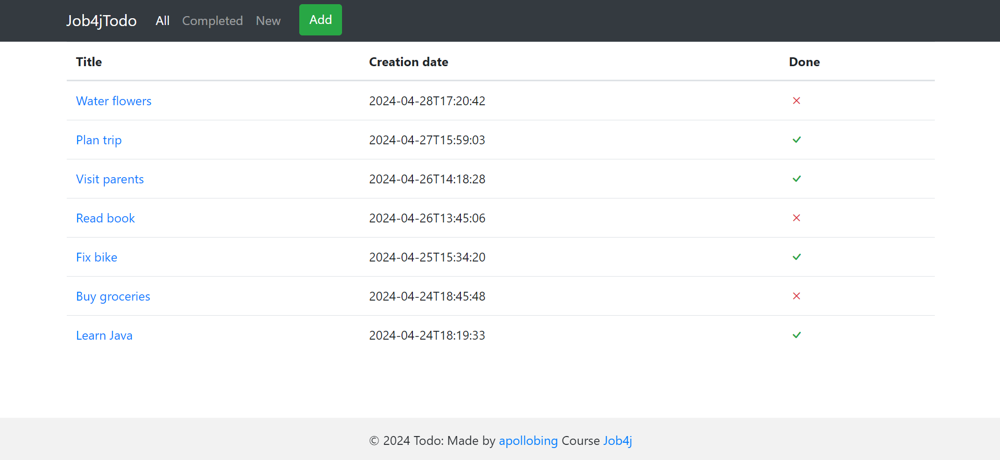
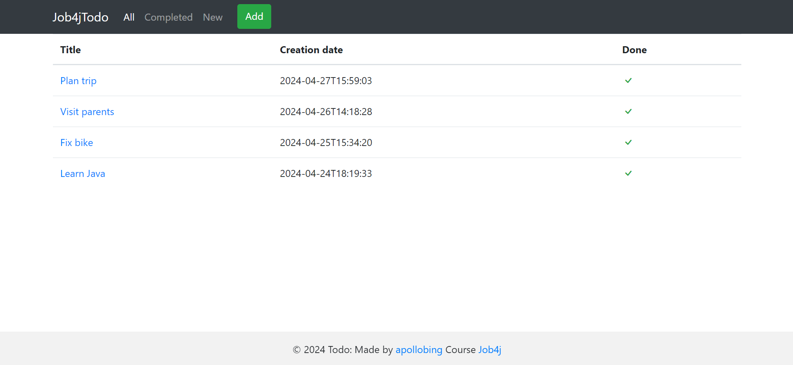
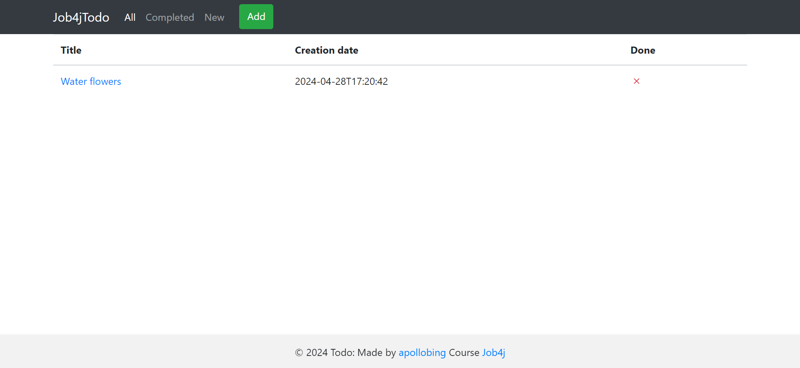
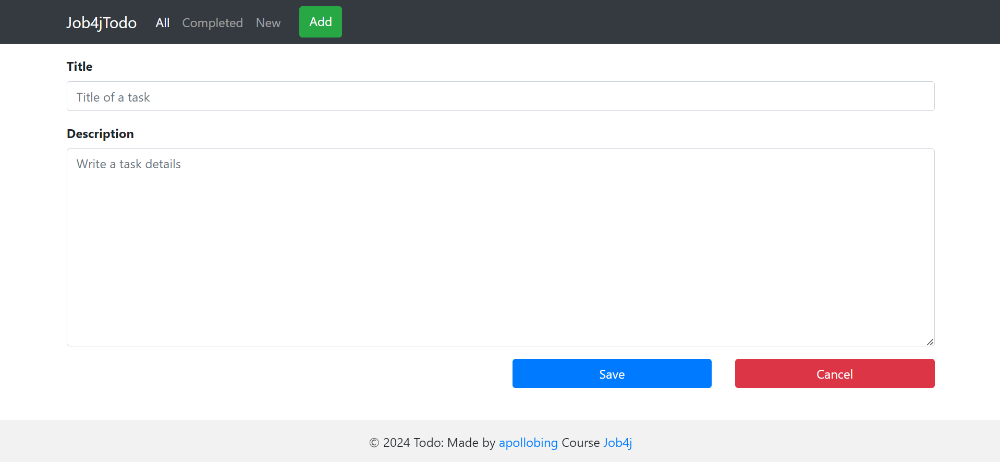
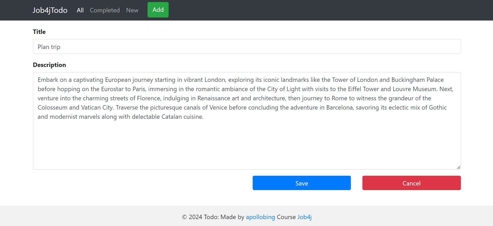
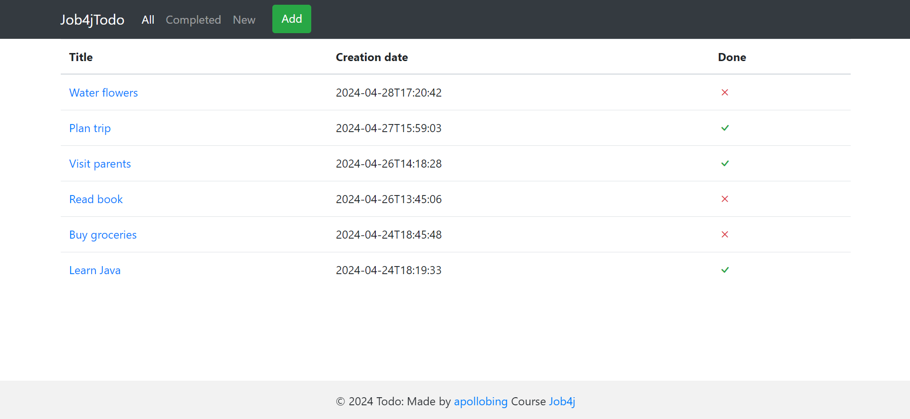

# job4j_todo

## About project

Job4jTodo project is a todo list which helps you to store your tasks.
Service provides next features:
* adding new tasks;
* displaying list of all, completed or new tasks;
* editing tasks;
* marking tasks as completed;
* deleting tasks.

A task contains title, description, creation date and status.
Data about tasks saves in DB.

Technologies used in the project:
* Spring boot 3.2.5
* Tomcat 10.1.20
* Thymeleaf 3.1.2
* Bootstrap 5.3.3
* Lombok 1.18.32
* Liquibase 4.27.0
* PostgreSQL 42.7.3
* h2database 2.2.224
* Hibernate 6.4.4
* c3p0 0.9.5.5
* jcip-annotations 1.0
* checkstyle-plugin 3.3.1
* puppycrawl 10.15.0

Necessary environment:
* Java 17
* Maven 3.9.4
* PostgreSQL 14

To run the application you need:

1. Create a database named `todo` in PostgreSQL
```
    create database todo;
```

2. In Profiles section on Maven tab choose `production` profile


3. Build the project and run the Spring Boot application
```
    mvn clean install -Pproduction
    mvn spring-boot:run
```
`Or instead of mvn spring-boot:run command, please run main() method in Main class`

4. Open http://localhost:8080/ in your browser


5. Optional: if needed test environment, you can choose `test` profile in Profiles section on Maven tab
   and execute commands:
    * `mvn clean install -Ptest`
    * `mvn spring-boot:run`
        * `Or instead of mvn spring-boot:run command, please run main() method in Main class`
### Screenshots

#### All tasks page:


#### Completed tasks page:


#### New tasks page:


#### Add task page:


#### Incomplete task page:


#### Completed task page:


#### Edit task page:


#### All tasks page (after deleting task):


If you have any questions about this project, please let me know.